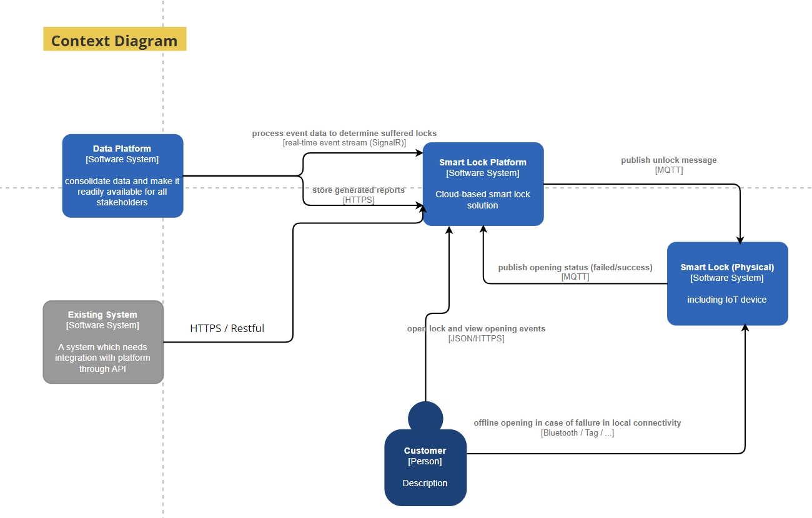
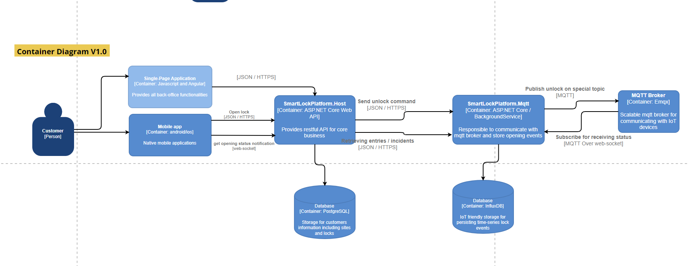
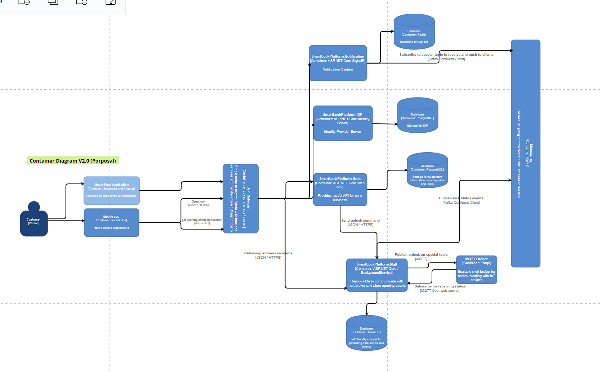
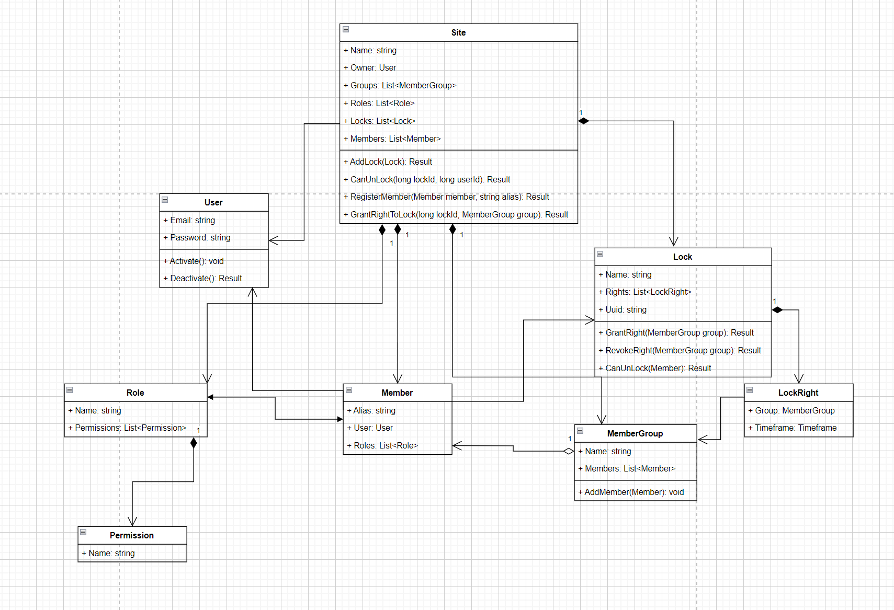

# SmartLockPlatfrom with an MVP mindset

## Architecture

### C4 Model

### Domain Model

### Communication with Smart Locks

We are using MQTT as a standard and lightweight pub/sub messaging protocol for Internt of Things. After investigating of the shelf brokers, we decided to pick Emqx as a scalable and reliable solution. For first version there is SmartLockPlatform.Mqtt application that its instances are responsible to be as a clients of broker to publish unlock message and receiving status messages from locks. 

### Authentication & Authorization

Nowadays it's crucial to have a standard implementation of OAuth2 and OpendID Connect as IDP to protected our API and allow access them by other systems on behalf of our customers. By the way, in first version we have in house JWT auth mechanism. In terms of authorization, we are using resource-based authorization mechanism in ASP.NET Core though implementing custom AuthorizationPolicyProvider and related requirements.

### Exception Handling

We are using global exception handling to deal with unhandled exception and log them via built in logging system with serilog provider. Actually we adopted Problem Details standard approach to provide error responses for clients.

### Validation

Validations are performed in different contexts. For input validation we are using built in annotations in .NET on top of our incomming requests` DTOs. Regarding business validation, we are checking some of them inside command handlers which they are great places for performing validations related to our use-cases such as preventing adding locks with duplicate uuid. Our domain model also follows always valid strategy and forces to modify state of objects with valid data.

### Testing

We are using xUnit and FluentAssertion for unit and integration testing as test framework and assertion tool. In addition, ASP.NET Core supports integration tests using unit test frameworks and test web host and in-memory test server which we are using this infrastructure.

